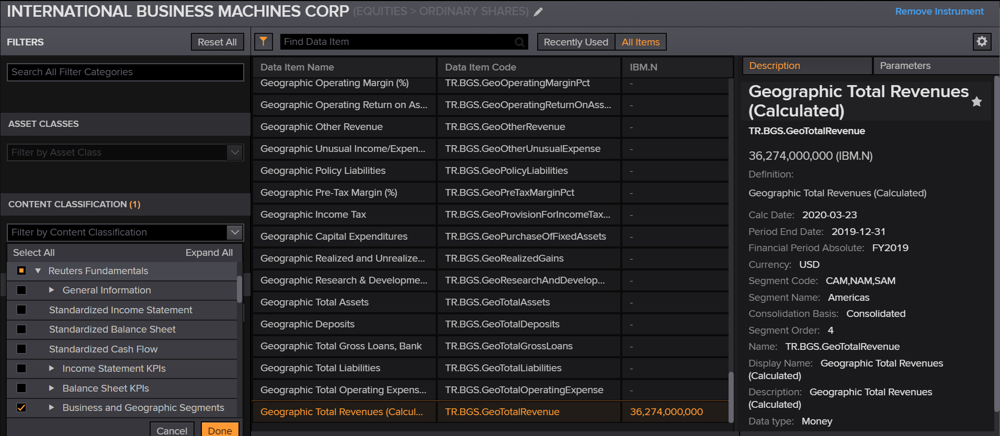
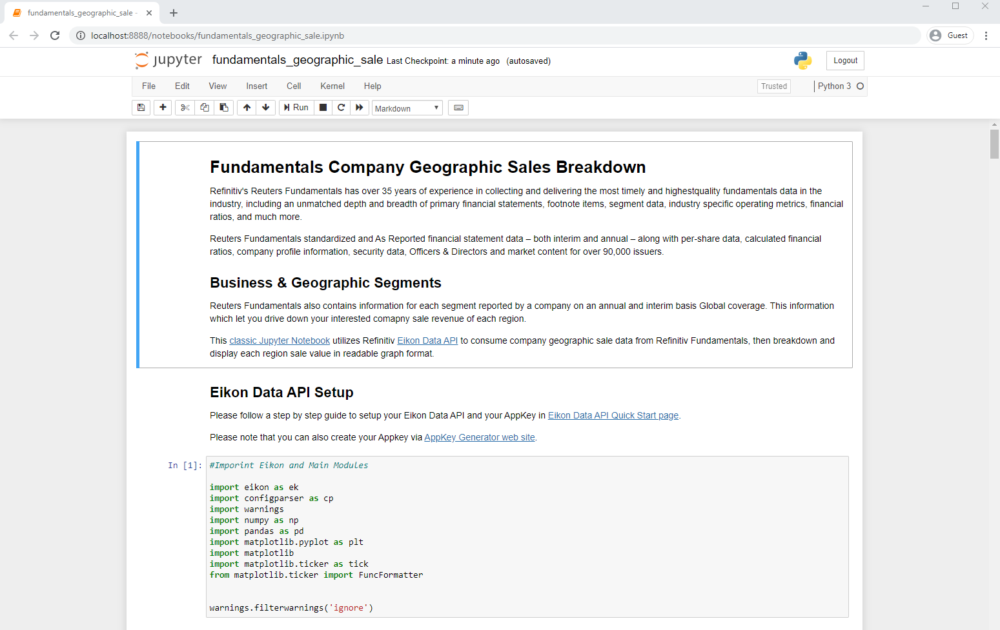
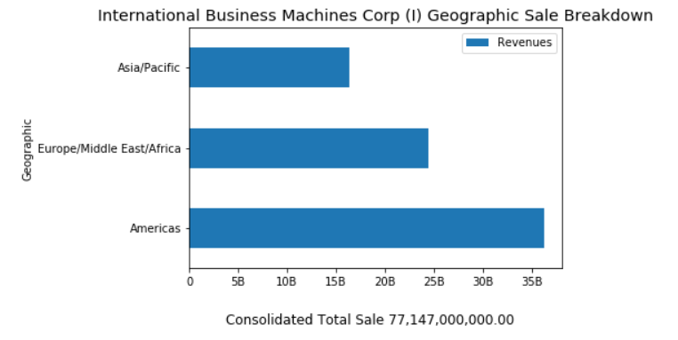

# Fundamentals Company Geographic Sales Breakdown
- Last update: March 2020
- Environment: Windows 
- Compiler: Python and Conda distribution
- Prerequisite: Refinitiv Eikon or Refinitiv Workspace application with access to Eikon Data APIs.

## <a id="overview"></a>Project Overview

Reuters Fundamentals has over 35 years of experience in collecting and delivering the most timely and highestquality fundamentals data in the industry, including an unmatched depth and breadth of primary financial statements, footnote items, segment data, industry specific operating metrics, financial ratios, and much more. 

Reuters Fundamentals standardized and As Reported financial statement data – both interim and annual – along with per-share data, calculated financial ratios, company profile information, security data, Officers & Directors and market content for over 90,000 issuers. 

## <a id="geographic"></a>Geographic Breakdown Fundamentals Data

Reuters Fundamentals also contains information for each segment reported by a company on an annual and interim basis Global coverage. This information which let you drive down your interested comapny sale revenue of each region.

This project shows how to use Refinitiv [Eikon Data API](https://developers.refinitiv.com/eikon-apis/eikon-data-api) to consume company geographic sale data from Refinitiv Fundamentals, then breakdown and display each region revenue in readable graph format in the [classic Jupyter Notebook](https://jupyter.org/) application.

 

## <a id="prerequisite"></a>Prerequisite
This example requires the following dependencies softwares and libraries.
1. Refinitiv Eikon or Refinitiv Workspace application with access to Eikon Data APIs.
2. Python [Ananconda](https://www.anaconda.com/distribution/) or [MiniConda](https://docs.conda.io/en/latest/miniconda.html) distribution/package manager.
3. [Classic Jupyter Notebook](https://jupyter.org/) web application.
4. Required Python Packages: [Eikon](https://pypi.org/project/eikon/), [Pandas](https://pypi.org/project/pandas/1.0.2/), [Numpy](https://pypi.org/project/numpy/1.18.1/) and [Matplotlib](https://pypi.org/project/matplotlib/3.1.3/) (They will be installed via conda environment creation).

*Note:* 
- This Project has been qualified with Python version 3.7.6 and Conda version 4.8.3
- If you are not familiar with Jupyter Notebook, the following [tutorial](https://www.datacamp.com/community/tutorials/tutorial-jupyter-notebook) created by DataCamp may help.

## <a id="application_files"></a>Application Files
This example project contains the following files and folders
1. *notebook_python/fundamentals_geographic_sale.ipynb*: The example Jupyter Notebook application file.
2. *global_sale_env.yml*: The Jupyter Notebook environment and dependencies configuration file.
3. *images*: Project images folder.
3. *LICENSE.md*: Project's license file.
4. *README.md*: Project's README file.

## <a id="eikon_setup"></a>Eikon Data API Setup

Please follow a step by step guide to setup your Eikon Data APIs and your AppKey in [Eikon Data API Quick Start page](https://developers.refinitiv.com/eikon-apis/eikon-data-api/quick-start). 

## <a id="running"></a>How to run this example

Please note that the Refintiv Workspace/Eikon application integrates a Data API proxy that acts as an interface between the Eikon Data API Python library and the Eikon Data Platform. For this reason, the Refinitiv Workspace/Eikon application must be running when you use the Eikon Data API Python library.

The first step is unzip or download the example project folder into a directory of your choice, then choose how to run application based on your environment below.

### Running the Notebook example.
1. Open Anaconda Prompt and go to project's folder
2. Run the following command in a Anaconda Prompt to create Conda environment named *MRN_TRNA* for the project.
    ```
    (base) $>conda env create -f global_sale_env.yml
    ```
3. Once the environment is created, activate Conda environment named ```global_sale``` with this command in Anaconda Prompt
    ```
    (base) $>conda activate global_sale
    ```
4. Go to project's notebook folder. and create a file name ```eikon.cfg``` with the following content
    ```
    [eikon]
    app_id = YOUR_APP_ID_HERE
    ```

5. In the current Anaconda Prompt, go to project's notebook folder. Run the following command to start classic Jupyter Notebook in the notebook folder.
    ```
    (global_sale) $>notebook>jupyter notebook
    ```
6. Open *fundamentals_geographic_sale.ipynb* Notebook document, then follow through each notebook cell.

     

## <a id="implementation"></a>Implementation

There are three main steps for this implementation
1. Get Company Geographic Sale Data.
2. Restructure Company Geographic Sale Data Dataframe object that returned from Eikon Data API.
3. Plotting a graph.

### Get Company Geographic Sale Data

Firstly, the Notebook application uses Eikon Data API ```get_data``` function to request the company fundamentals via following  fields:
- TR.BGS.GeoTotalRevenue.segmentName: Segment (Geographic) data
- TR.BGS.GeoTotalRevenue: Each segment revenue value
- TR.CompanyName

```
df,err = ek.get_data('IBM.N', ['TR.BGS.GeoTotalRevenue.segmentName', 'TR.BGS.GeoTotalRevenue','TR.CompanyName'])
df
```

 

This ```get_data``` function returns data as [Pandas Dataframe object](https://pandas.pydata.org/pandas-docs/stable/reference/api/pandas.DataFrame.html) by default. 

### Restructure Company Geographic Sale Data Dataframe object.

The returned Dataframe object from Eikon ```get_data``` function is not ready to be plotted as "readable" graph yet. 

We start by renaming the *Segment Name* and *Geographic Total Revenues (Calculated)* columns to readable names like *Geographic* and *Revenues*.

```
df_graph = df.copy()

df_graph.rename(columns={
                   'Segment Name':'Geographic',
                   'Geographic Total Revenues (Calculated)':'Revenues'},
         inplace = True)

df_graph
```

 

Then we get the Company name and Consolidated Total Revenue information from Dataframe object.

```
total_sale = df_graph.iloc[df_graph.shape[0] - 1]['Revenues']

company_name = df_graph.iloc[0]['Company Name']
```

And the last thing on this phase is to remove the Total revenue rows from the Dataframe as we will display a Consolidated Total information at a graph footter.

```
df_graph = df_graph[df_graph['Geographic'] != 'Segment Total']
df_graph = df_graph[df_graph['Geographic'] != 'Consolidated Total']
```

### Plotting a graph

Finally, we are now ready for plotting a graph. We create a Python function ```format_revenues_number``` to reformat large revenue numbers into a readable numbers in trillions, billions or millions unit. a readable numbers in trillions, billions or millions unit. This function source code is based on [Dan Friedman](https://github.com/frieds/frieds.github.io)'s [How to Format Large Tick Values tutorial](https://github.com/frieds/frieds.github.io/tree/master/data-visualizations/how_to_format_large_tick_values_files) source code via GitHub.

```
def format_revenues_number(tick_val, pos):
    """
    Turns large tick values (in the trillions, billions, millions and thousands) such as 4500 into 4.5K 
    and also appropriately turns 4000 into 4K (no zero after the decimal).
    """
    if tick_val >= 1000000000000: # Add support for trillions
        val = round(tick_val/1000000000000, 1)
        new_tick_format = '{:}T'.format(val)
    elif tick_val >= 1000000000:
        val = round(tick_val/1000000000, 1)
        new_tick_format = '{:}B'.format(val)
    elif tick_val >= 1000000:
        val = round(tick_val/1000000, 1)
        new_tick_format = '{:}M'.format(val)
    elif tick_val >= 1000:
        val = round(tick_val/1000, 1)
        new_tick_format = '{:}K'.format(val)
    elif tick_val < 1000:
        new_tick_format = round(tick_val, 1)
    else:
        new_tick_format = tick_val

     # make new_tick_format into a string value
    new_tick_format = str(new_tick_format)
    """
    code below will keep 4.5M as is but change values such as 4.0M to 4M since that 
    zero after the decimal isn't needed
    """
    index_of_decimal = new_tick_format.find(".")
    
    if index_of_decimal != -1:
        value_after_decimal = new_tick_format[index_of_decimal+1]
        if value_after_decimal == "0":
            # remove the 0 after the decimal point since it's not needed
            new_tick_format = new_tick_format[0:index_of_decimal] + new_tick_format[index_of_decimal+2:]
            
    return new_tick_format
```

We use Python [matplotlib.pyplot](https://matplotlib.org/api/pyplot_api.html) library to plot a bar graph that represent each region revenue from restructured Dataframe object in Jupyter Notebook.


```
# Plotting a Graph

df_graph.set_index('Geographic',drop=True,inplace=True)
fig = plt.figure()

#Format Total Sale display unit as a graph footer.
fig.text(.5, -.05, 'Consolidated Total Sale %s' %(f'{total_sale:,.2f}'), ha='center',fontsize='large')

# Create graph title from Company and RIC names dynamically.
plt.ticklabel_format(style = 'plain')
plt.title('%s (%s) Geographic Sale Breakdown' % (company_name, 'IBM.N'), color='black',fontsize='x-large')
ax = fig.gca()

#Apply Sale data into millions function.
formatter = FuncFormatter(format_revenues_number)
ax.xaxis.set_major_formatter(formatter)

df_graph.plot(kind='barh', ax = fig.gca())
plt.show()
```

 

## <a id="summary"></a>Conclusion

Refinitiv provides a wide range of Reuters Fundamentals data for your investment decisions including company geographic sale information. This information helps you analysis the revenue from each geographic region of your interested company in both panel data and graph formats.

## <a id="references"></a>References

You can find more detail regarding the Eikon Data APIs and related technologies for this Notebook from the following resources:
* [Refinitiv Eikon Data API page](https://developers.refinitiv.com/eikon-apis/eikon-data-api) on the [Refinitiv Developer Community](https://developers.refinitiv.com/) web site.
* [Eikon Data API Quick Start Guide page](https://developers.refinitiv.com/eikon-apis/eikon-data-api/quick-start).
* [Eikon Data API Tutorial page](https://developers.refinitiv.com/eikon-apis/eikon-data-api/learning).
* [Python Quants Video Tutorial Series for Eikon API](https://community.developers.refinitiv.com/questions/37865/announcement-new-python-quants-video-tutorial-seri.html).
* [Eikon Data APY Python Reference Guide](https://docs-developers.refinitiv.com/1584688434238/14684/book/en/index.html).
* [Eikon Data API Troubleshooting article](https://developers.refinitiv.com/article/eikon-data-apipython-troubleshooting-refinitiv).
* [Dan Friedman's Python programming, data analysis, data visualizations tutorials](https://github.com/frieds/frieds.github.io).
* [Pandas API Reference](https://pandas.pydata.org/docs/reference/index.html).
* [Pyplot Graph API Reference](https://matplotlib.org/api/pyplot_api.html).

For any question related to this example or Eikon Data API, please use the Developers Community [Q&A Forum](https://community.developers.refinitiv.com/spaces/92/eikon-scripting-apis.html).